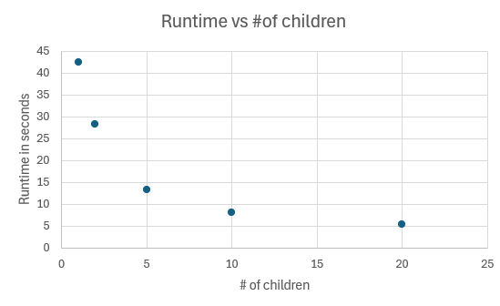

# System Programming Lab 11 Multiprocessing

This repository contains a Mandelbrot fractal generator and a movie generator program. The Mandelbrot generator creates still images of the Mandelbrot fractal, while the movie generator utilizes child processes to generate a sequence of images and create a movie.

## Overview

The Mandelbrot set is a well-known fractal that exhibits intricate patterns and complex structures. This program generates multiple frames, each representing a different zoom level into the set, which can later be combined to create an animation.

### Features
- Generate multiple frames of the Mandelbrot set in JPEG format.
- Adjustable parameters for zoom level, image resolution, maximum iterations, and more.
- Multi-process support for concurrent frame generation.

## How to Compile
To compile the program, you need a C compiler (e.g., `gcc`) and the JPEG library (`libjpeg`). You can compile the code with the following command:

gcc -o mandel mandel.c -lpthread -ljpeg

## Usage
The program supports several command-line arguments to customize the generation of Mandelbrot frames. Here is the usage:
./mandel [options]

### Options
- `-x <coord>`: X coordinate of the image center point. Default is `0`.
- `-y <coord>`: Y coordinate of the image center point. Default is `0`.
- `-s <scale>`: Scale of the image in Mandelbrot coordinates (X-axis). Default is `4`.
- `-W <pixels>`: Width of the image in pixels. Default is `1000`.
- `-H <pixels>`: Height of the image in pixels. Default is `1000`.
- `-m <max>`: The maximum number of iterations per point. Default is `1000`.
- `-c <num>`: Number of child processes to use for parallel generation. Default is `1`.
- `-h`: Show the help text.

### Example Usage
Here are some examples of how to run the program:

1. Generate frames with default parameters:
   ./mandel
   

2. Generate frames with a zoomed-in view centered at (-0.5, -0.5):
   ./mandel -x -0.5 -y -0.5 -s 0.2

3. Generate frames with 4 child processes in parallel:
   ./mandel -c 4

4. Generate a high-resolution image with a specific zoom level:
   ./mandel -x 0.286932 -y 0.014287 -s 0.0005 -W 2000 -H 2000 -m 2000

## How It Works
The program generates frames by calculating the Mandelbrot set for a grid of complex numbers corresponding to the pixels in the image. Each frame is created by the following steps:

1. **Initialization**: The program initializes an image buffer and sets the color for the background.
2. **Computation**: Each pixel is mapped to a point in the complex plane, and the number of iterations required to determine if the point belongs to the Mandelbrot set is computed.
3. **Output**: The image is saved as a JPEG file, and this process is repeated for all frames.
4. **Parallel Processing**: The program uses `fork()` to create child processes, each of which generates a frame. A semaphore (`sem_t`) controls how many processes can run concurrently.

## Explanation of Key Parameters
- **Scale (`-s`)**: This parameter controls the zoom level. A smaller scale results in a zoomed-in view of the Mandelbrot set, while a larger scale zooms out.
- **Iterations (`-m`)**: The maximum number of iterations determines how detailed the set is. A higher iteration count results in better quality, especially for zoomed-in regions, but takes more time.
- **Child Processes (`-c`)**: The number of child processes specifies how many frames can be generated concurrently. For example, `-c 3` allows three child processes to run simultaneously.

## Performance Considerations
- **Concurrency (`-c`)**: Increasing the number of child processes (`-c`) can significantly reduce runtime, especially if the machine has multiple CPU cores. However, if the number of child processes exceeds the available cores, you may experience diminishing returns or even slower performance due to context-switching overhead.
- **Iteration Complexity**: Zooming into intricate areas of the Mandelbrot set often results in more complex boundaries, which require more iterations, and thus, longer computation times. Reducing the maximum iterations (`-m`) or image resolution (`-W`, `-H`) can speed up the frame generation at the cost of visual detail.

## Combining Frames into a Movie
The generated frames can be combined into a movie using a tool like `ffmpeg`:

ffmpeg -i mandel_out_%d.jpg mandel_movie.mpg

This command will create a video (`mandel_movie.mpg`) from the frames, simulating a zoom-in effect on the Mandelbrot set.

## Example Output
The program will generate output files named `mandel_out_1.jpg`, `mandel_out_2.jpg`, and so on, until all `NUM_FRAMES` have been generated.

## Troubleshooting
- **Images Taking Too Long**: If frames take too long to generate, try reducing the image resolution (`-W` and `-H`) or the maximum number of iterations (`-m`). You can also reduce the number of frames (`NUM_FRAMES`) or increase the number of child processes (`-c`).
- **Zooming Out Instead of In**: If the generated images appear to be zooming out, make sure that the `scale` is properly decreasing over time. The correct formula for zooming in is `double scale = xscale / (1 + frame * 0.1);`.

## Part 1: Modified Mandel.c
The mandel program was modified. This program utilized child processes to generate 50 images, progressively altering one or more image parameters; such as scale, origin and size. The flexibility of choosing the number of children at the command line was integrated into the program, and command-line interpretation uses the getopt function. A semaphore is used for managing the children's processes.

## Graph image

 

1 - 42.522
2 - 28.259 
5 - 13.174
10 - 8.058
20 - 5.398

as displayed through the data above and my graph shows that the more children processes there are, the smaller the runtime. However, it seems as if the number of children stopped helping the speedup over time because the graph appears as if it is starting to plateau
